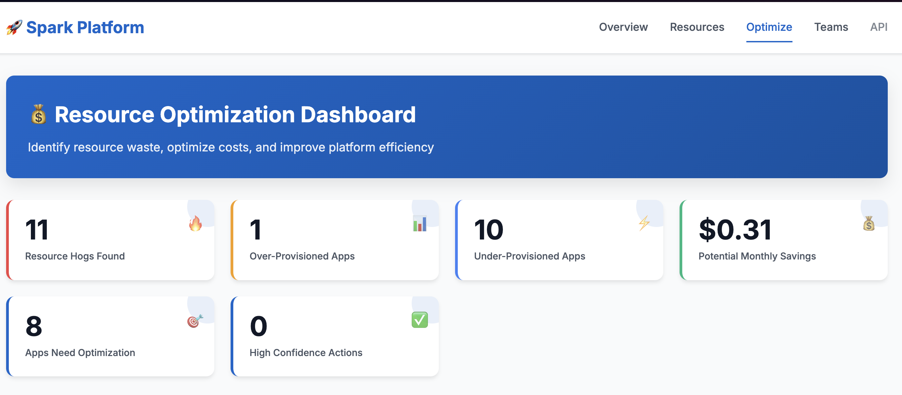

# Spark History Server (Rust)

[](https://www.rust-lang.org/)
[](https://spark.apache.org/)
[](https://duckdb.org/)
[](https://opensource.org/licenses/Apache-2.0)

A **high-performance, analytics-first** Spark History Server built in Rust. Unlike traditional history servers focused on individual application details, this server excels at **cross-application analytics and trends** using DuckDB's analytical power.

**🏆 Proven Performance: 100,000+ applications, 2M events, 10,700 events/sec**



## ✨ What Makes This Different

### ✅ **Analytics-First Design**
- **Cross-application insights**: Query metrics across thousands of Spark applications simultaneously  
- **Performance trends**: Time-series analysis of resource usage and system health
- **Resource optimization**: Identify underutilized executors and memory bottlenecks across your entire Spark estate

### ✅ **Enterprise-Ready Infrastructure**
- **Real HDFS integration** with Kerberos authentication
- **DuckDB analytical backend** for lightning-fast aggregations
- **Circuit breaker protection** for fault-tolerant operations
- **Single binary deployment** - no external dependencies

### ❌ **What We Don't Do** (Use Standard Spark History Server Instead)
- Individual job/stage/task drill-down details
- Real-time application debugging
- SQL query execution plan analysis

## 🚀 Quick Start

### 1. Run the Server

```bash
# Download and build
git clone https://github.com/your-repo/spark-history-server-rs
cd spark-history-server-rs
cargo build --release

# Start with local Spark events
./target/release/spark-history-server --log-directory ./spark-events

# Or with HDFS
./target/release/spark-history-server \
  --hdfs \
  --hdfs-namenode hdfs://namenode:9000 \
  --log-directory /spark-events

# With Kerberos authentication
./target/release/spark-history-server \
  --hdfs \
  --hdfs-namenode hdfs://secure-namenode:9000 \
  --kerberos-principal spark@EXAMPLE.COM \
  --keytab-path /etc/security/keytabs/spark.keytab \
  --log-directory /hdfs/spark-events
```

### 2. Access the Dashboard

```bash
# Web Dashboard
open http://localhost:18080                     # Cluster overview
open http://localhost:18080/optimize            # Resource optimization insights

# API Endpoints  
curl "http://localhost:18080/api/v1/applications?limit=10"
curl "http://localhost:18080/api/v1/analytics/cross-app-summary"
curl "http://localhost:18080/api/v1/optimization/resource-hogs"
```

## 🎯 Key APIs & Features

### 📊 **Analytics APIs** (Our Strength)
- `GET /api/v1/analytics/cross-app-summary` - Enterprise-wide Spark metrics
- `GET /api/v1/optimization/resource-hogs` - Top resource consuming applications
- `GET /api/v1/optimization/efficiency-analysis` - Over/under-provisioned apps
- `GET /api/v1/capacity/usage-trends` - Capacity planning insights

### 📋 **Standard Spark History Server API v1** (Compatibility)
- `GET /api/v1/applications` - Application listing with filtering
- `GET /api/v1/applications/{appId}` - Application details  
- `GET /api/v1/applications/{appId}/executors` - Executor information

### 🎨 **Web Dashboard**
- **Cluster Overview**: Real-time cluster status and key metrics
- **Optimization Dashboard**: Resource hogs, efficiency analysis, cost optimization
- **Performance Trends**: Historical analysis and capacity planning

## ⚙️ Configuration

Create `config/settings.toml`:

```toml
[server]
host = "0.0.0.0"
port = 18080

[history]
# Local or HDFS path to Spark event logs
log_directory = "/tmp/spark-events"
# or log_directory = "hdfs://namenode:9000/spark-events"

max_applications = 1000
update_interval_seconds = 60
compression_enabled = true
database_directory = "./data"

# Optional HDFS configuration
[history.hdfs]
namenode_url = "hdfs://namenode:9000"
connection_timeout_ms = 30000
read_timeout_ms = 60000

[history.hdfs.kerberos]
principal = "spark@EXAMPLE.COM" 
keytab_path = "/etc/security/keytabs/spark.keytab"
```

## 🏗️ Architecture

- **Event Processing**: Real `hdfs-native` integration with circuit breaker protection
- **Storage**: DuckDB embedded analytical database optimized for cross-app queries
- **APIs**: Dual support for standard Spark History Server v1 + advanced analytics
- **Dashboard**: Built-in web interface with multiple analytical views

## 🧪 Testing

```bash
# Run all tests
cargo test

# HDFS integration tests  
./scripts/run-hdfs-tests.sh

# Performance testing
cargo test test_100k_applications_load --release

# Code quality
cargo clippy --all-targets --all-features -- -D warnings
```

## 📈 Performance

- **Scale**: 100K+ applications, 2M+ events tested
- **Throughput**: 10,700+ events/sec sustained
- **Query Speed**: <10ms for analytical queries  
- **Storage**: 229 bytes per event average
- **Deployment**: Single binary, embedded database

## 🤝 Use Cases

**Perfect For:**
- Platform engineering teams analyzing Spark cluster performance
- Capacity planning and resource optimization
- Historical trend analysis across multiple applications
- Cost optimization and efficiency insights

**Not Ideal For:**
- Debugging individual Spark applications
- Real-time application monitoring
- Detailed task-level performance analysis

---

**License**: Apache 2.0 | **Language**: Rust | **Database**: DuckDB | **UI**: Built-in Web Dashboard